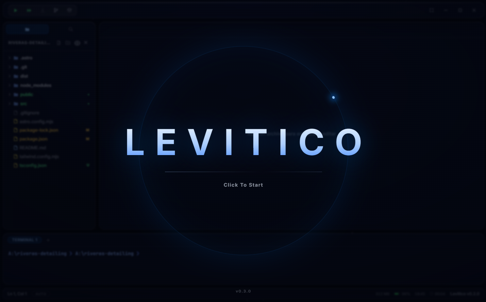

# Levitico

> **Note**: This project was created for **personal use** and its code was **generated 100% with AI**. It doesn't aim to compete with any professional editor.



## Features

- **Space-themed glassmorphism UI** — floating glass panels over an animated starfield, Inter + JetBrains Mono typography, frameless window with custom controls, **3 themes** (blue, black, red), adjustable glass opacity, and interface in **Spanish or English**.
- **Monaco editor** (the engine behind VS Code) with a custom theme and syntax highlighting for **~95 languages and technologies** (TypeScript, Python, Java, Rust, Astro, Vue, Svelte, Terraform, Solidity…), with validation squiggles disabled: colors only. Word wrap follows the window width. Includes **autosave**, **Markdown preview**, and an image viewer.
- **Multiple tabs**, VS Code style: files stack up, with an unsaved-changes indicator and `Ctrl+W` to close.
- **File explorer** with create/rename/delete (deletes go to the Recycle Bin), **drag & drop** to move entries into a folder or back out to the root, git status colors like VS Code (green = new, orange = modified, red = deleted), and dimmed `.gitignore`d entries. It refreshes live when anything changes on disk.
- **Global search** (`Ctrl+Shift+F`) across the whole project, with replace, and **Quick Open** (`Ctrl+P`) to jump to any file.
- **Integrated terminal** (xterm + PowerShell) with multiple sessions in tabs, folder navigation (`cd`), arrow-key history, **in-line editing** (arrows, Home/End, Delete, insert at cursor), `Ctrl+C`, and interactive stdin.
- **One-click execution**:
  - ▶ runs the current file based on its language (Python, Node, Java, Go, Rust, C/C++, C#, PHP, Ruby…).
  - ⏩ runs the whole project: detects `package.json`, runs `npm install` if `node_modules` is missing, then launches `npm run dev`.
  - If a tool is missing (Python, Node, JDK…), a modal takes you to the **official download link**.
- **Automatic preview**: when the dev server prints its URL (`http://localhost:...`), it opens in your browser automatically.
- **Built-in Git**: initialize a repository (on `main`), pick files with checkboxes, commit, create/switch branches, view history, pull, and **push to GitHub** from the UI. The panel refreshes itself while open, and a **sensitive-info scanner** warns before committing API keys, tokens, private keys or `.env` files.
- **DevOps panel**: detects Docker, Kubernetes, Terraform and GitHub Actions in your project, runs the common commands, and generates starter files (Dockerfile, compose, k8s manifests, `main.tf`, CI/release workflows, `.gitignore`).
- **Resizable panels** (explorer, editor, terminal) with sizes persisted across sessions, plus session restore of your project and open files.
- **Live status bar**: detected language, cursor position, app RAM usage, battery, clock, and session time.

## Development

```bash
npm install
npm run dev
```

## Building the installer (.exe)

```bash
npm run build
```

Output lands in `release/<version>/`:

- `Levitico-Windows-<version>-Setup.exe` — installer
- `win-unpacked/Levitico.exe` — portable version

## Stack

| Layer | Technology |
|---|---|
| Desktop | Electron 30 |
| UI | React 18 + TypeScript + Vite |
| Editor | Monaco Editor (`@monaco-editor/react`) |
| Terminal | @xterm/xterm + PowerShell (no node-pty: the cwd lives in the main process) |
| Packaging | electron-builder (NSIS) |

## Structure

```
my-ide/
├── electron/          # main process: window, fs, terminal, git, watcher, metrics
│   ├── main.ts
│   └── preload.ts     # secure bridge (contextBridge) to the renderer
├── src/
│   ├── App.tsx        # layout, tabs, execution, git panel
│   ├── i18n.ts        # UI strings in Spanish and English
│   ├── languages.ts   # detection of ~95 languages/technologies
│   ├── SpaceBg.ts     # animated starfield background (30 fps)
│   └── components/
│       ├── Editor.tsx        # Monaco + levitico themes
│       ├── Terminal.tsx      # interactive xterm terminal (multi-session)
│       ├── FileTree.tsx      # explorer with git status and drag & drop
│       ├── SearchPanel.tsx   # project-wide search and replace
│       ├── QuickOpen.tsx     # Ctrl+P file jumper
│       ├── DevOpsPanel.tsx   # Docker/K8s/Terraform/CI helpers
│       ├── Preview.tsx       # Markdown preview and image viewer
│       └── StatusExtras.tsx  # RAM, battery, clock, session
└── electron-builder.json5
```

## License

[MIT](LICENSE) — free to use, copy, and modify. Provided "as is", without warranty of any kind.

> **Heads up when installing**: the installer is not code-signed, so Windows SmartScreen will show an "unknown publisher" warning. Click "More info" → "Run anyway". This is normal for independent open-source projects.

---

*Made with 🤖 — every line of this project (including this README) was written by AI.*
